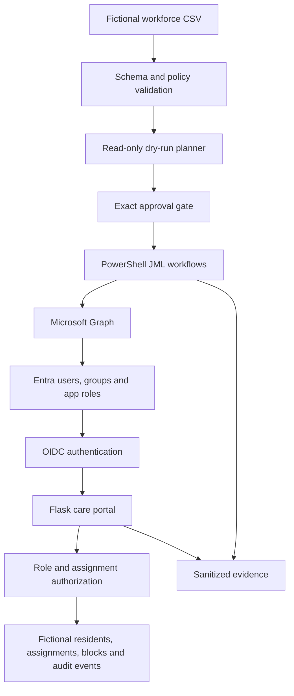

# Sunhaven Care Workforce IAM

Sunhaven Care Workforce IAM is a security-focused student laboratory that demonstrates identity governance for a fictional care organisation. It combines Microsoft Entra ID, Microsoft Graph, PowerShell automation and a Flask application to implement and test workforce Joiner–Mover–Leaver (JML) processes, role-based authorization, immediate leaver denial, auditable change control and access review.

The project uses only fictional `TEST` identities and resident records. It is an educational prototype—not a production healthcare system—and must not be used with real patient, resident or employee data.

## Project outcomes

- Automated validated Joiner, Mover and Leaver workflows against an explicit Microsoft Entra tenant.
- Enforced least-privilege access through Entra security groups and application roles.
- Restricted care workers and agency workers to assigned fictional residents.
- Protected clinical and manager routes with server-side role checks.
- Revoked sessions and applied a local application block during leaver processing.
- Produced sanitized, UTC-correlated audit evidence and an evidence-backed access review.
- Passed 14 core security and lifecycle tests (`TC-001` through `TC-014`).
- Completed repository secret scanning, Git-history review and private-release handover controls.

## Architecture



### Main components

| Component | Responsibility |
|---|---|
| Microsoft Entra ID | Authenticates fictional users and stores governed security-group and application-role assignments. |
| Microsoft Graph | Provides explicit, auditable directory reads and approved JML write operations. |
| PowerShell automation | Validates inputs, builds read-only plans, applies approved lifecycle changes and verifies final state. |
| Flask application | Uses OIDC login and server-side authorization for protected care-portal routes. |
| SQLite | Stores fictional residents, worker-to-resident assignments, local leaver blocks and sanitized application audit events. |
| Evidence pipeline | Captures sanitized results, screenshots, audit correlations, test outcomes and handover records. |

## Security and workflow design

### Joiner

1. Validate the workforce CSV locally without using Microsoft Graph.
2. Connect with read-only Graph permissions and generate a proposed plan.
3. Require the exact approval phrase before any write operation.
4. Revalidate the tenant and immutable target identifiers.
5. Create one identity and assign one approved security group and application role.
6. Require a password change at first sign-in without recording the generated password.
7. Read back the final state and emit a sanitized result.

### Mover

1. Verify the current and intended roles.
2. Remove the old application role and governed group.
3. Update workforce attributes.
4. Add the new group and application role.
5. Revoke sign-in sessions so stale role claims cannot remain authoritative.
6. Verify old access is absent and new access is present.

### Leaver

The leaver sequence fails closed and follows a deliberate order:

1. Disable the Entra account.
2. Revoke Entra sign-in sessions.
3. Remove Sunhaven-governed group memberships.
4. Remove Sunhaven application-role assignments.
5. Block the current local application session.
6. Read back and record the final state.

### Application authorization

- Authentication is handled by Microsoft identity integration for Flask.
- Role checks occur on the server, not only in the user interface.
- `CareWorker` and `AgencyWorker` access is scoped through active worker-to-resident assignments.
- `Nurse` and `Manager` roles can access clinical functionality according to the RBAC matrix.
- Unauthorized role access returns HTTP `403` and generates a sanitized audit event.
- A local block is checked on every protected request to provide immediate denial for an already signed-in leaver.
- Application sessions have a fixed 15-minute lifetime and are not refreshed on every request.

## Safety controls

- Explicit tenant-ID validation occurs before directory writes.
- Dry-run planning uses read-only Graph permissions and executes zero writes.
- Apply operations require `-Apply` and an exact employee-specific approval phrase.
- Lifecycle scripts use immutable object IDs and validate mapped resource names.
- Apply and rerun operations are idempotent; compliant state returns `NO CHANGE`.
- Final-state readback verifies groups, app roles, attributes, account status and session controls.
- Passwords, client secrets, access tokens and authorization headers are excluded from evidence.
- Real `.env` files, raw exports, recovery bundles and private identifier inventories are excluded from Git.

## Repository layout

```text
sunhaven-workforce-iam/
├── app/            Flask application, templates, SQLite layer and local block utility
├── automation/     Input validation, planning, JML and access-review PowerShell scripts
├── config/         Application-role, group and route-role mappings
├── data/           Fictional workforce input
├── docs/           Design and workforce-schema documentation
├── evidence/       Sanitized implementation, test and handover evidence
├── tests/          Fictional positive and negative lifecycle test inputs
└── README.md
```

## Prerequisites

- macOS, Linux or Windows with a terminal
- Git
- Python 3 with `venv` and `pip`
- PowerShell 7 (`pwsh`)
- A dedicated Microsoft Entra lab tenant
- A registered Entra web application and enterprise application
- Microsoft Graph PowerShell SDK modules required by the automation scripts
- An administrator/operator account with only the permissions required for the selected workflow
- A modern web browser

The project was developed on macOS. PowerShell and path syntax may require minor adjustment on other platforms.

## Setup

### 1. Clone and enter the repository

```bash
git clone <PRIVATE_REPOSITORY_URL>
cd sunhaven-workforce-iam
```

Keep the repository private because the evidence contains tenant-specific laboratory identifiers and screenshots.

### 2. Create the Python environment

```bash
python3 -m venv .venv
source .venv/bin/activate
python -m pip install --upgrade pip
python -m pip install -r app/requirements.txt
```

On Windows PowerShell, activate the environment with:

```powershell
.\.venv\Scripts\Activate.ps1
```

### 3. Configure the Flask application

Copy the Entra sample configuration that matches the laboratory identity scenario:

```bash
cp app/.env.sample.entra-id app/.env
```

Populate `app/.env` locally with the tenant and application configuration. Never commit this file or paste credentials into evidence, issues or documentation.

Review the non-secret mappings in:

- `config/app-registration.json`
- `config/app-role-ids.json`
- `config/group-object-ids.json`
- `config/route-role-map.csv`

Use identifiers from your own lab tenant. Do not reuse identifiers from another environment.

### 4. Install the Microsoft Graph PowerShell modules

Install the Graph SDK if it is not already available:

```powershell
Install-Module Microsoft.Graph -Scope CurrentUser
```

The scripts validate required commands before running and authenticate interactively to the explicitly supplied tenant.

### 5. Validate the application code

```bash
cd app
python -m py_compile app.py database.py
cd ..
```

### 6. Start the Flask portal

```bash
cd app
python -m flask --app app run --host localhost --port 5000
```

Open `http://localhost:5000`. If port `5000` is already in use, stop the existing listener or choose another local port and ensure the configured redirect URI matches it.

## Running the automation safely

### Validate a workforce file

```bash
pwsh -NoProfile \
  -File ./automation/Test-WorkforceInput.ps1 \
  -InputPath ./data/workforce.csv \
  -ErrorPath ./evidence/validation-errors.csv \
  -SummaryPath ./evidence/validation-summary.txt
```

This step is local and read-only. It does not connect to Microsoft Graph.

### Generate a read-only dry-run plan

```bash
pwsh -NoProfile \
  -File ./automation/Get-WorkforceDryRunPlan.ps1 \
  -TenantId "<LAB_TENANT_ID>" \
  -TenantDomain "<LAB_TENANT_DOMAIN>" \
  -InputPath ./data/workforce.csv \
  -ValidationErrorPath ./evidence/validation-errors.csv \
  -ValidationSummaryPath ./evidence/validation-summary.txt \
  -PlanPath ./evidence/dry-run-plan.csv \
  -SummaryPath ./evidence/dry-run-summary.txt
```

Confirm that the summary reports `Write operations executed: 0`. Inspect every proposed action before considering an apply operation.

### Apply a lifecycle operation

Apply commands are intentionally not provided as copy-and-run examples in this README. First review the relevant script parameters and the approved dry-run plan:

```powershell
Get-Command ./automation/Invoke-SunhavenJoiner.ps1 -Syntax
Get-Command ./automation/Invoke-SunhavenMover.ps1 -Syntax
Get-Command ./automation/Invoke-SunhavenLeaver.ps1 -Syntax
```

An authorized operator must use the explicit tenant, reviewed input and plan, `-Apply`, and the exact employee-specific approval phrase printed by the safety check. Test only with fictional identities in a dedicated lab tenant.

## Testing and evidence

The final test crosswalk is stored at:

```text
evidence/phase7/P7-E02_Core-Test-Crosswalk.csv
```

The test suite covers:

- Joiner creation and rerun idempotency
- Assigned-resident access and clinical-route denial
- Nurse clinical access
- CareWorker-to-Nurse movement and stale-session handling
- Invalid-role and duplicate-employee-ID rejection
- Agency-worker expiry planning
- Live leaver enforcement and new sign-in denial
- Access-review denial and remediation
- Repository secret/privacy scanning
- Wrong-tenant fail-closed protection

All 14 core tests passed on the identified release candidate. The final handover, risk register, lessons learned and cleanup plan are versioned under `evidence/phase7/`.

## Key measured results

- Leaver workflow execution: **7.57 seconds** in the recorded lab rehearsal.
- Workflow start to observed application denial: **16.76 seconds**.
- Identity creation to first successful application access: **339.77 seconds**.
- Core security and lifecycle tests passed: **14 of 14**.

These results describe one controlled laboratory run and are not production service-level guarantees.

## Limitations

- This is a student-controlled laboratory, not a production IAM or healthcare platform.
- Only fictional users and residents are permitted.
- Microsoft Entra premium governance capabilities require eligible licensing; the project uses an evidence-backed lab access-review workflow where native premium functionality is unavailable.
- SQLite and local session blocking are suitable for this demonstration but would require production-grade persistence, availability and operational controls in a real deployment.
- Human approval remains required for directory-changing operations.
- The live demonstration should use a shortened script and the existing sanitized evidence as backup.

## Release and cleanup

- Final release tag: `sunhaven-final-v1.0.0`
- Keep the lab operational until assessment and demonstration are accepted.
- After acceptance, follow `evidence/phase7/P7-E130_Post-Assessment-Cleanup-Plan.md`.
- Revoke or rotate client credentials, revoke sessions, disable or delete remaining test identities, remove governed access and retire unused lab resources.
- Never upload private raw exports, recovery bundles, `.env` files or the private identifier inventory.

## Ethical and privacy statement

This repository demonstrates security engineering using invented workforce and resident records. It is intentionally designed to avoid real personal, clinical or authentication data. Any extension of the project must preserve data minimization, least privilege, explicit authorization, auditable change control and secure evidence handling.

