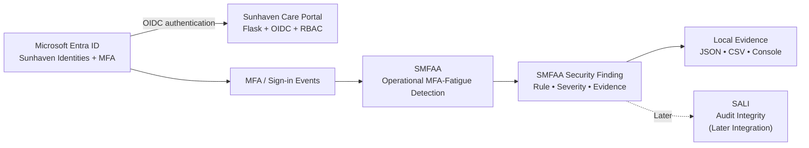
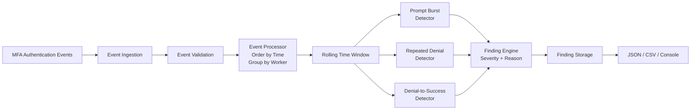
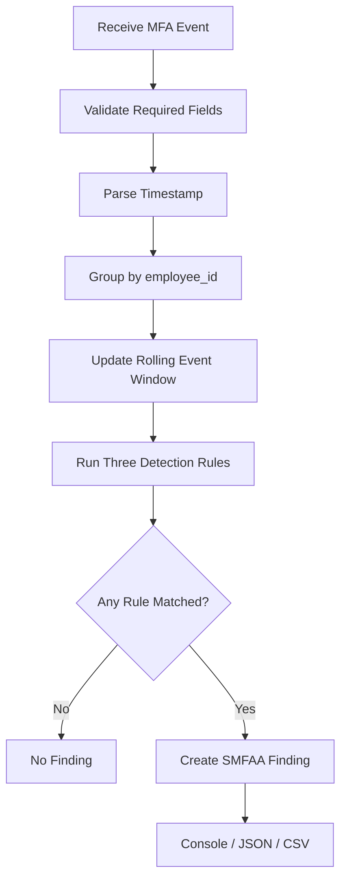

# SMFAA Architecture and Design

## 1. Purpose

This document defines the simple architecture and design baseline for the **Sunhaven MFA Fatigue Attack Analyzer (SMFAA)**.

The design intentionally keeps SMFAA easy to understand, test and demonstrate.

---

## 2. Diagram 1 — SMFAA Integration within the Sunhaven Care IAM Architecture

This diagram answers:

> **Where does SMFAA sit in the complete Sunhaven solution?**



### Explanation

- Entra remains the authentication and MFA authority.
- Flask remains the protected application.
- SMFAA receives MFA/sign-in events separately.
- SMFAA creates findings but does not make access decisions.
- SALI is only a future consumer of findings.

---

## 3. Diagram 2 — SMFAA Individual Solution Design

This diagram answers:

> **What happens inside SMFAA?**



### Explanation

The internal process is intentionally simple:

```text
Receive event
   ↓
Validate
   ↓
Order and group by worker
   ↓
Apply rolling time window
   ↓
Run three detectors
   ↓
Create explainable finding
   ↓
Export evidence
```

---

## 4. Diagram 3 — Operational Detection Workflow

This diagram explains the runtime processing step by step.



---

## 5. Repository Placement

SMFAA should sit inside the main Sunhaven repository under `services/`:

```text
Sunhaven-main/
├── app/
├── automation/
├── config/
├── data/
├── docs/
├── evidence/
├── services/
│   └── smfaa/
│       ├── src/
│       ├── config/
│       ├── data/
│       ├── tests/
│       ├── reports/
│       ├── evidence/
│       ├── docs/
│       └── README.md
└── sunhaven-sitas-threat-simulator/
```

This makes SMFAA part of the operational Sunhaven solution while keeping it separate from the Flask application code.

---

## 6. Planned Internal Components

| Component | Responsibility |
|---|---|
| `smfaa.py` | Main CLI/service entry point |
| `event_loader.py` | Load controlled MFA events |
| `event_validator.py` | Validate event fields and values |
| `event_processor.py` | Order events, group by employee and maintain rolling windows |
| `detectors.py` | Implement the three MFA-fatigue rules |
| `finding_engine.py` | Build explainable findings |
| `report_generator.py` | Console, JSON and CSV output |
| `sunhaven_adapter.py` | Read fictional Sunhaven workforce context without changing it |
| `detection-rules.json` | Store configurable thresholds and time windows |

---

## 7. Core Design Rule

SMFAA must remain an observer/detector:

```text
SMFAA CAN:
receive events
analyse events
create findings
export evidence

SMFAA CANNOT:
disable users
revoke sessions
change MFA
change roles
execute JML
change Flask access
perform remediation
```

This boundary keeps the component simple and prevents overlap with the rest of the Sunhaven project.
