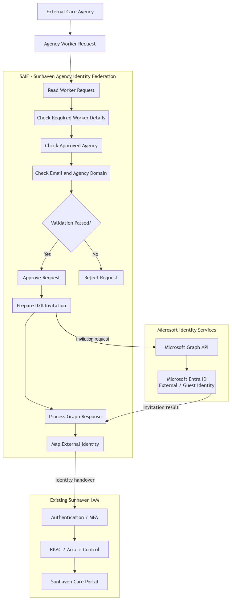
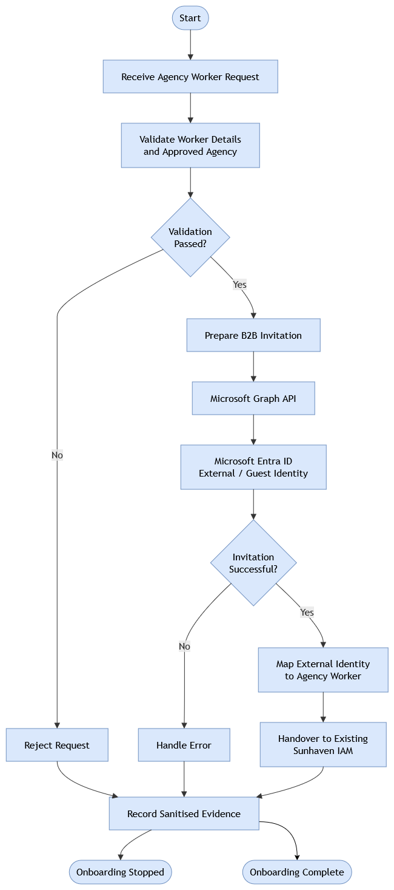
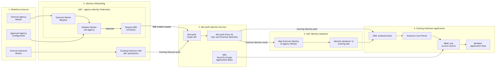

# SAIF — Sunhaven Agency Identity Federation

## Overview

Sunhaven Agency Identity Federation (SAIF) is an external identity onboarding component developed for the Sunhaven Care Identity and Access Management project.

SAIF provides a controlled process for introducing approved external care-agency workers into the existing Sunhaven Microsoft Entra identity environment.

The component validates an external worker and their agency before allowing the request to continue to Microsoft Entra B2B onboarding. After a successful B2B invitation, SAIF maps the resulting Entra user object ID back to the original agency worker and prepares a handover to the existing Sunhaven IAM environment.

SAIF does not replace the project's existing authentication, MFA, RBAC, Joiner-Mover-Leaver, session, resident-access or application authorization controls.

---

## Why SAIF Is Needed

The Sunhaven Care scenario includes a high-turnover workforce containing permanent staff, casual workers and external agency workers.

The existing Sunhaven IAM implementation already provides controls for internally managed workforce identities, authentication, application roles and access control.

External agency workers introduce an additional identity problem because their identity originates outside Sunhaven. Treating every external worker exactly like an internally managed permanent employee would not clearly separate external identity onboarding from Sunhaven's existing workforce lifecycle controls.

---

## SAIF Solution

The Sunhaven Care scenario involves a high-turnover workforce that includes casual staff and external agency workers. These workers may need access to Sunhaven systems while their identity originates outside the organisation.

SAIF provides a controlled external identity onboarding solution for this part of the scenario.

Instead of creating a separate Sunhaven password or treating an external agency worker exactly like an internally managed permanent employee, SAIF uses Microsoft Entra B2B collaboration to introduce the external worker into the existing Sunhaven Microsoft Entra environment.

The SAIF solution works as follows:

1. An external agency-worker request is received by SAIF.
2. SAIF checks that the required worker information is present.
3. SAIF checks that the worker belongs to an agency approved by Sunhaven.
4. SAIF checks that the worker's email domain is consistent with the configured agency.
5. If validation fails, SAIF stops the process and the worker is not sent to the B2B invitation stage.
6. If validation succeeds, SAIF prepares the external identity invitation.
7. Microsoft Graph is used to create the Microsoft Entra B2B invitation.
8. The external worker is represented in Microsoft Entra as an external/Guest identity after the invitation process.
9. SAIF records the Entra user object ID and maps it to the original agency-worker information.
10. SAIF prepares an identity handover to the existing Sunhaven IAM environment with `AgencyWorker` as the requested role.

SAIF therefore provides the external identity entry point while the existing Sunhaven IAM system continues to control authentication, MFA, role assignment, RBAC, resident access, sessions, JML processes and application authorization.

---

## How SAIF Supports the Sunhaven Scenario

SAIF supports the high-turnover workforce scenario by providing a dedicated onboarding path for external agency workers.

It supports rapid but controlled onboarding by validating the worker and approved agency before Microsoft Graph is used. Invalid, incomplete, unknown or blocked requests are rejected before B2B onboarding.

SAIF also integrates with the Microsoft Entra environment already used by the project instead of creating a separate identity platform. This allows SAIF to extend the existing solution without duplicating its authentication, RBAC, JML or application-access controls.

---

## Project Alignment

SAIF extends the existing Sunhaven Care IAM solution by addressing the external agency-worker identity onboarding problem within the high-turnover workforce scenario.

The overall project already provides the core Sunhaven IAM environment, including Microsoft Entra identities, authentication, application roles, RBAC, JML automation, resident-access controls and the protected Sunhaven Care Portal.

SAIF adds a controlled entry path for an identity that originates outside Sunhaven.

The integration path is:

**External Agency Worker → SAIF Validation → Microsoft Graph → Microsoft Entra B2B Guest Identity → SAIF Identity Mapping → Existing Sunhaven IAM → Existing Authentication and Access Controls → Sunhaven Care Portal**

SAIF and the existing IAM implementation therefore have separate responsibilities.

| SAIF Responsibility | Existing Sunhaven IAM Responsibility |
|---|---|
| Receive external agency-worker request | Authenticate the resulting identity |
| Validate required worker information | Apply MFA controls |
| Check approved agency | Manage application roles |
| Check agency/email-domain consistency | Enforce RBAC |
| Reject invalid external onboarding requests | Manage resident assignments |
| Prepare B2B invitation | Enforce session controls |
| Send invitation through Microsoft Graph | Manage JML processes |
| Map agency worker to Entra user object ID | Perform access review |
| Prepare IAM handover with requested `AgencyWorker` role | Authorize access to the Sunhaven Care Portal |

The common integration point is the Microsoft Entra user object ID.

SAIF records the Entra user object ID produced by the external identity onboarding process. The existing Sunhaven application uses the Entra `oid` claim as its application `object_id`, providing a clear identity boundary between SAIF and the existing application.

SAIF does not claim that producing the handover automatically grants application access. The existing Sunhaven IAM implementation remains responsible for assigning the appropriate role and enforcing authorization after the identity has been handed over.

---

## Architecture

SAIF is documented through three architecture views. Together, these diagrams show the internal SAIF component, the external worker onboarding workflow, and how SAIF integrates with the overall Sunhaven IAM solution.

### SAIF Component Architecture



The component architecture shows how an external worker is validated before B2B onboarding. Approved requests continue through Microsoft Graph and Entra, followed by identity mapping and handover to the existing Sunhaven IAM. Rejected requests stop before Graph processing.

---

### External Worker Onboarding Flow



The onboarding flow shows SAIF's fail-closed decision process. Invalid requests are rejected, while approved workers continue through B2B invitation, Entra external identity creation, identity mapping and IAM handover.

---

### Integrated Solution Architecture



The integrated architecture shows where SAIF fits within the overall Sunhaven solution. Internal workers continue through the existing IAM/JML path, while external agency workers enter through SAIF and Microsoft Entra B2B. After identity handover, the existing Sunhaven system remains responsible for authentication and access control.

---

## Main Components

| Component | Responsibility |
|---|---|
| `saif_agency_validation.py` | Validates worker details and approved agency information. |
| `saif_b2b_invitation.py` | Prepares the Microsoft Entra B2B invitation. |
| `saif_graph_transport.py` | Connects the SAIF workflow to the Graph invitation script. |
| `Invoke-SAIFB2BInvitation.ps1` | Creates the B2B invitation through Microsoft Graph. |
| `saif_identity_mapping.py` | Maps the agency worker to the Entra user object ID. |
| `saif_iam_handover.py` | Prepares the identity for the existing Sunhaven IAM system. |
| `saif_workflow.py` | Coordinates the complete SAIF workflow. |
| `tests/` | Contains automated SAIF tests. |

---

## Security and Workflow Design

SAIF follows a fail-closed external identity onboarding process.

1. Receive an external agency-worker request.
2. Validate required worker information.
3. Check the approved agency and email-domain consistency.
4. Reject the request if validation fails.
5. Prepare a Microsoft Entra B2B invitation if validation succeeds.
6. Send the invitation through Microsoft Graph.
7. Map the resulting Entra user object ID to the agency worker.
8. Prepare the identity for handover to the existing Sunhaven IAM system.

A live laboratory test successfully created and redeemed a B2B invitation, and the resulting Microsoft Entra identity was verified as an accepted `Guest` user.

The email-domain check is only a consistency check and does not prove ownership of the external identity. External authentication remains part of the Microsoft Entra B2B process.

---

## Component Boundary

### SAIF Handles

- external agency-worker validation;
- approved agency checking;
- Microsoft Entra B2B invitation processing;
- external identity mapping; and
- IAM handover preparation.

### Existing Sunhaven IAM Handles

- authentication and MFA;
- application-role assignment and RBAC;
- resident access;
- JML lifecycle processes;
- session controls;
- access review; and
- Sunhaven Care Portal authorization.

SAIF uses the Entra user object ID as the identity connection to the existing Sunhaven system.

`AgencyWorker` is passed as a requested role during handover. SAIF does not assign the application role itself.

---

## Security Controls

SAIF applies the following security controls:

- only approved agencies can continue to external identity onboarding;
- invalid or incomplete worker requests fail closed;
- rejected requests do not continue to Microsoft Graph;
- external workers use Microsoft Entra B2B identities rather than SAIF-managed passwords;
- Graph errors stop the onboarding workflow;
- secrets, passwords and access tokens are not stored in the repository; and
- SAIF does not bypass the existing Sunhaven authentication or authorization controls.

Detailed controls are documented in:

`Security Policies/SAIF-External-Identity-Policy.md`

---

## Repository Layout

```text
sunhaven-saif-agency-identity-federation/
├── config/              Approved agency configuration
├── data/                Fictional agency-worker data
├── src/                 SAIF Python implementation
├── scripts/             Microsoft Graph B2B PowerShell integration
├── tests/               Automated SAIF tests
├── docs/diagrams/       Architecture and workflow diagrams
├── Security Policies/   SAIF security policy
├── evidence/            Selected implementation and test evidence
└── README.md
```

---

## Running and Testing

### Run the Automated Tests

From the SAIF directory:

```powershell
python -m pytest tests -v
```

The current SAIF test suite contains **13 passing tests** covering:

- worker and agency validation;
- B2B invitation preparation;
- Graph transport success and failure;
- external identity mapping;
- IAM handover; and
- approved and rejected workflow paths.

### Microsoft Graph B2B Test

Microsoft Graph authentication was tested using the delegated `User.Invite.All` permission in the project laboratory tenant.

The B2B PowerShell integration is located at:

```text
scripts/Invoke-SAIFB2BInvitation.ps1
```

A live test successfully created a B2B invitation. The external invitation was received and redeemed, and the resulting Microsoft Entra identity was verified with:

- `UserType: Guest`
- `ExternalUserState: Accepted`

The automated Python Graph transport tests use mocked results and therefore do not create live guest users during normal automated testing.

---

## Evidence

Selected evidence is stored in the `evidence/` directory and demonstrates:

- Microsoft Graph authentication and permission;
- successful live B2B invitation;
- invitation email delivery;
- Entra Guest identity creation and acceptance; and
- 13 passing automated tests.

Passwords, access tokens, client secrets and verification codes are not intentionally stored as project evidence.

---

## Limitations

SAIF is a student laboratory implementation, not a production identity federation system.

Current limitations include:

- invitation redemption requires user interaction;
- SAIF requests but does not assign the `AgencyWorker` role;
- the existing Sunhaven IAM remains responsible for RBAC, JML, MFA and application access;
- email-domain matching is a consistency check, not proof of identity ownership; and
- automated Graph transport tests use mocked results rather than creating live guest users.

---

## Ethical and Privacy Statement

SAIF uses fictional agency and worker information for this student project. Authentication secrets, passwords and access tokens must not be committed to the repository or included in assessment evidence.

---

## Microsoft References

SAIF was designed using Microsoft documentation for external identity and Microsoft Graph integration.

- Microsoft Entra B2B Collaboration  
  https://learn.microsoft.com/en-us/entra/external-id/what-is-b2b

- Microsoft Entra B2B Invitation Service  
  https://learn.microsoft.com/en-us/entra/external-id/invitation-service

- Microsoft Graph Invitation API  
  https://learn.microsoft.com/en-us/graph/api/invitation-post?view=graph-rest-1.0

- Microsoft Entra B2B User Properties  
  https://learn.microsoft.com/en-us/entra/external-id/user-properties